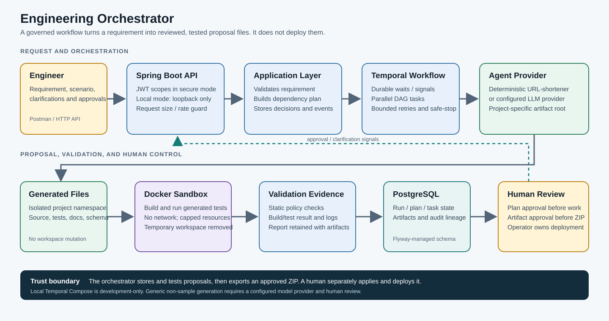
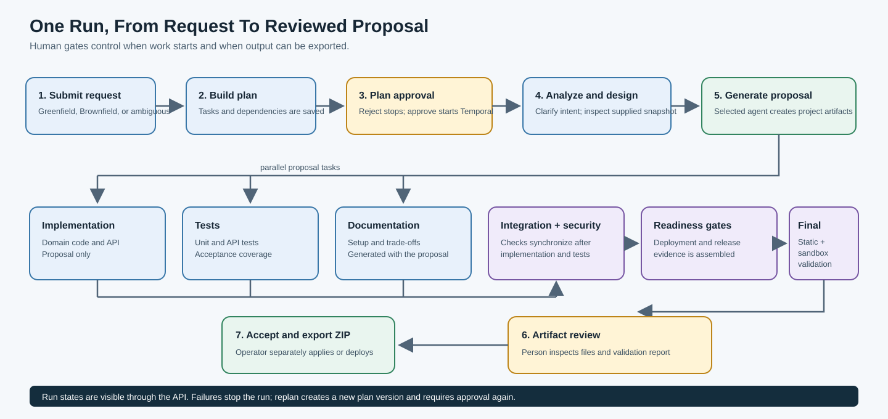

# Engineering Orchestrator

Turn a software requirement into a plan, a reviewable code proposal, and test evidence. The orchestrator coordinates the work; it does not deploy code or edit a target repository.

> **What is included:** The deterministic offline generator is a URL-shortener sample. Other service domains require the configured OpenAI-compatible model provider. Model-generated projects are proposals, not guaranteed production-ready software.

## Architecture

The image shows the runtime components and where outputs go. The generated service stays isolated until a person downloads its approved ZIP.



## How A Run Works



Independent graph tasks can run in parallel and synchronize at their dependencies. Workflows pause for plan approval, clarification when needed, and artifact review. Temporal retries activities within configured bounds; PostgreSQL retains run state and decision lineage.

## Feature Map

| Area | Implemented behavior | Boundary |
|---|---|---|
| Requirement and planning | Greenfield, Brownfield, and ambiguous scenarios; explicit task dependency graph and plan approval. | Scenario coverage is scoped to engineering proposals, not arbitrary unattended deployment. |
| Brownfield input | Bounded, read-only caller-supplied files; revision label; candidate impacted-file list and regression/compatibility checklist. | The service does not scan a local Git checkout or verify the declared revision. Analysis is a candidate for human review. |
| Code generation | Deterministic URL-shortener sample offline; optional model-backed generation for request-derived domains such as `generated/inventory/`. | Generic generation requires a working provider. If the provider fails, it does not substitute URL-shortener output. |
| Validation | Required-by-default final validation, domain-specific URL-shortener checks, generic structure/domain checks, and generated Maven tests in isolated Docker. | Passing tests do not prove full semantic correctness, compliance, or production readiness. |
| Safe handling | Artifacts are path-confined, size-limited, persisted for review, and exported only after approval. | The ZIP is not installed, committed, or deployed by the orchestrator. |
| Security and operations | JWT scopes in `secure` mode, loopback-only unauthenticated `local` mode, request limits, audit events, Actuator/Prometheus, and OSV dependency scan. | Rate limiting is per process. The bundled Temporal server is for development. |

## Start Locally

Requirements: Java 21+, Docker Desktop, and PowerShell.

Start PostgreSQL and Temporal:

```powershell
docker compose up -d postgres temporal
```

Start the orchestrator from the repository root and leave this terminal running:

```powershell
.\mvnw.cmd spring-boot:run
```

The default `local` profile disables authentication and binds to `127.0.0.1:8080`. **Do not expose this profile to a LAN, proxy, or production.** The local Temporal UI is at `http://localhost:8233`.

Check readiness and scenario examples:

```powershell
Invoke-RestMethod http://127.0.0.1:8080/actuator/health
Invoke-RestMethod http://127.0.0.1:8080/api/v1/scenarios
```

Stop the app with `Ctrl+C`. `docker compose down` stops the dependencies but keeps the PostgreSQL data volume.

## Generate Other Service Domains

The built-in deterministic provider is for the URL-shortener sample. For inventory or another domain, configure a real OpenAI-compatible provider **before starting Spring Boot**:

```powershell
$env:ORCHESTRATOR_AGENT_PROVIDER = 'openai-compatible'
$env:ORCHESTRATOR_AGENT_API_KEY = '<enter your provider key locally; never commit it>'
$env:ORCHESTRATOR_AGENT_BASE_URL = 'https://api.openai.com/v1'
$env:ORCHESTRATOR_AGENT_MODEL = 'gpt-4.1-mini'
.\mvnw.cmd spring-boot:run
```

If the provider is not enabled, unsupported Greenfield domains receive HTTP 422 before a run is created. The model-backed path derives a project root from the request, asks the provider for plan and artifacts, checks domain naming and project structure, and runs generated tests in the sandbox. A provider error fails closed rather than using URL-shortener templates. Review model-generated plans, code, tests, and validation evidence; no provider key is configured in this repository's test environment, so an actual generic live generation must be tested with your provider account.

Keep provider keys in environment variables or a secret manager. Never commit them or include them in snapshots.

## Secure Mode

For an identity provider, configure its actual issuer and explicitly use the `secure` profile:

```powershell
$env:AUTH_ISSUER_URI = 'https://your-real-identity-provider/issuer'
.\mvnw.cmd '-Dspring-boot.run.profiles=secure' spring-boot:run
```

The JWT must carry the appropriate scope:

- `orchestrator:write`: create/replan a run or submit clarification.
- `orchestrator:read`: inspect runs and export accepted artifacts.
- `orchestrator:approve`: approve/reject plans and artifacts.
- `orchestrator:ops`: access operational metrics.

## Submit And Follow A Run

The [Postman collection](postman/README.md) includes Greenfield, Brownfield, ambiguous, generic inventory, and monitoring examples. Quick PowerShell example for the deterministic URL-shortener sample:

```powershell
$body = @{
  requirement = 'Build a URL shortener with expiring links, safe redirects, and click analytics'
  scenario = 'GREENFIELD'
} | ConvertTo-Json

$run = Invoke-RestMethod -Method Post `
  -Uri 'http://127.0.0.1:8080/api/v1/runs' `
  -ContentType 'application/json' -Body $body

$run | Select-Object id, scenario, status, planVersion
```

The new run normally waits at `AWAITING_APPROVAL`. Review its plan, then approve it:

```powershell
$runId = $run.id
$decision = @{ approved = $true; actor = 'local-reviewer'; note = 'Plan reviewed' } | ConvertTo-Json
Invoke-RestMethod -Method Post `
  -Uri "http://127.0.0.1:8080/api/v1/runs/$runId/decision" `
  -ContentType 'application/json' -Body $decision
```

Fetch current run, task, audit, and artifact status:

```powershell
$current = Invoke-RestMethod "http://127.0.0.1:8080/api/v1/runs/$runId"
$current | Select-Object id, status, failureReason
$current.tasks | Select-Object nodeKey, status, attemptCount, outputSummary | Format-Table
$current.artifacts | Select-Object taskKey, path, status
```

If the run reaches `AWAITING_CLARIFICATION`, submit answers to `/api/v1/runs/{runId}/clarification`. At `AWAITING_ARTIFACT_REVIEW`, inspect the artifacts and `validation-report.md`; approve/reject them at `/api/v1/runs/{runId}/artifacts/decision`. Accepted files can be downloaded from `/api/v1/runs/{runId}/artifacts/export`. Export is a ZIP download only, not deployment.

The API does not currently list all runs. Save each returned run ID. Common states are `AWAITING_APPROVAL`, `RUNNING`, `AWAITING_CLARIFICATION`, `AWAITING_ARTIFACT_REVIEW`, `COMPLETED`, and `FAILED`.

## Scenarios

- **Greenfield:** new URL-shortener sample with deterministic mode, or a different domain with the configured model provider.
- **Brownfield:** provide `scenario: "BROWNFIELD"`, a caller-declared `snapshotRevision`, and `codebaseSnapshot` files. Maximum 25 files and 120 KB combined. The revision is not Git-verified; impact/compatibility output is a candidate for review, not proof.
- **Ambiguous:** use `scenario: "AMBIGUOUS"`. The workflow creates questions and waits for human answers before continuing.

## Verification

```powershell
# Unit and API suite
.\mvnw.cmd -B test

# Real PostgreSQL 17 Testcontainers integration suite; Docker required
.\mvnw.cmd -B -Pintegration verify

# Exercise the URL-shortener generated project in the network-disabled Docker sandbox
.\mvnw.cmd -B '-Dorchestrator.validation.enabled=true' '-Dorchestrator.validation.required=true' '-Dtest=AgenticOrchestratorApplicationTests' test

# Online OSV scan; no NVD database download
docker run --rm -v "${PWD}:/src" ghcr.io/google/osv-scanner:v2.6.0 scan source --recursive /src
```

## More Detail

- [Traceability and known boundaries](docs/traceability.md)
- [Architecture and trust boundaries](docs/architecture.md)
- [Operations runbook](docs/runbook.md)
- [Postman demo guide](postman/README.md)
